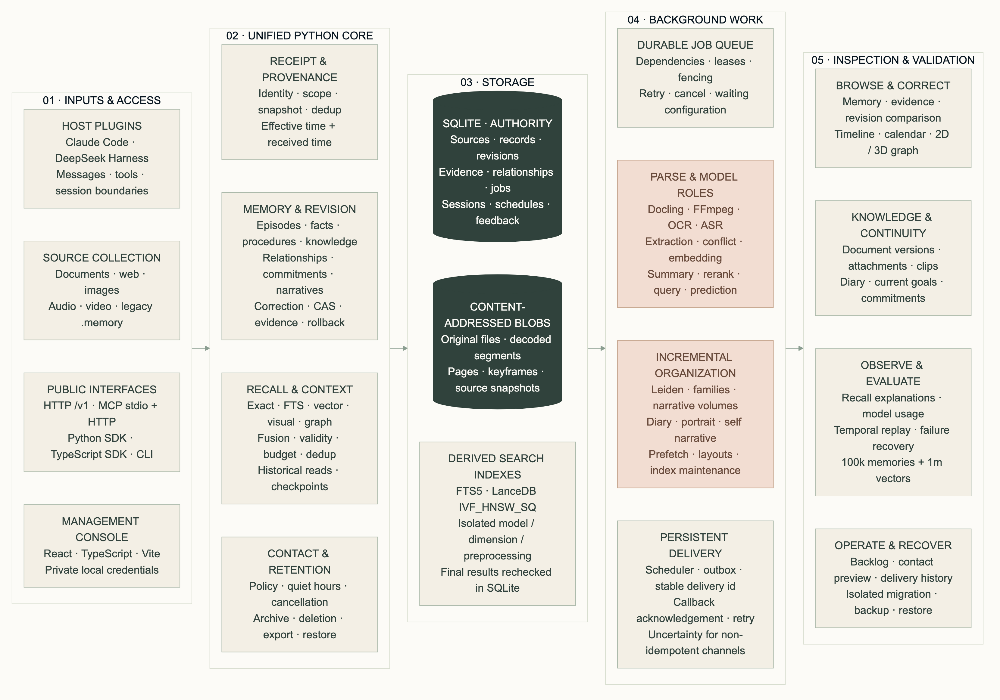

# MemoryPalace 1.0

[中文](README.md) · [English](README.en.md) · **日本語**

ツール連携、コンパニオン、知識蓄積に対応するシングルユーザー向け記憶システムです。情報源、事実、経験、関係、約束、知識チャンク、継続状態を一つの Python コアで管理し、プラグイン、CLI、管理画面、HTTP、MCP、SDK から利用できます。



## 機能

- **永続的な取り込み**：情報源のスナップショット、ハッシュ、重複排除、トランザクション、revision 検査、永続ジョブ。モデルが失敗しても情報源と処理進捗を保持します。
- **用途別の記憶**：エピソード、事実・状態、手順、関係、共有体験、約束・リマインダー、日記、自己記述、知識、checkpoint。プロジェクト、役割、コレクション、現実・創作世界を個別に指定します。
- **共通の検索**：正確な手がかり、FTS5、LanceDB ベクトル、視覚ベクトル、関係を統合。履歴時点の読み取り、有効状態の再検査、コンテキスト予算、ホスト間の重複排除に対応します。
- **バックグラウンド整理**：抽出・競合の提案、増分 Leiden 分類、トピックファミリーと叙事ボリューム、出典付き要約・日記・プロフィール、修訂とロールバック。
- **マルチモーダル**：PDF、DOCX、PPTX、XLSX、Markdown、HTML、CSV、画像、音声、動画。ページ、段落、表、時刻、添付ファイルへの参照を保持します。
- **能動的な連絡**：役割別の通知、約束の確認、記念日、状況確認、挨拶。タイムゾーン、静かな時間帯、頻度、確認、延期、取消、永続的な配信履歴を設定できます。
- **管理画面**：処理状況、仮想スクロール、出典、修訂比較、タイムライン・カレンダー、2D／3D 関係図、知識・添付、日記、検索実験、連絡とデータ管理。

生成内容には生成属性を残します。推論、ユーザーの明示的な発言、観測された操作を区別し、同じ出典の反復引用を独立した証拠として数えません。

## インストール

GitHub リポジトリから提供します。PyPI・npm への自動公開は行いません。Python 3.11–3.13、Node.js 22、[uv](https://docs.astral.sh/uv/) を使用します。

```sh
git clone https://github.com/mycyg/memory-palace.git
cd memory-palace
uv sync --frozen --extra all --extra dev
npm ci --prefix sdk/typescript
npm run build --prefix sdk/typescript
npm ci --prefix console
npm run build --prefix console
uv run eventmem console
```

管理画面とサービスは `http://127.0.0.1:8319`、個人データは既定で `~/.memorypalace` に保存されます。`eventmem serve` でサービスを起動し、`--root /private/path` で別のデータベースを選択できます。ローカル認証情報、Host、Origin を検査します。実際の記憶、添付、秘密情報、実行ログはリポジトリに含めません。

管理画面で抽出、競合、要約、再ランキング、embedding、視覚、ASR などのモデルを設定します。互換 API・ローカル端点を利用でき、役割間でモデルを共有できます。秘密鍵は環境変数名で指定します。未設定の役割は設定待ちとなり、元の情報源は保持されます。

## 接続と使用例

| 接続 | 機能 |
|---|---|
| Claude Code プラグイン | メッセージ・ツール収集、起動復元、操作前検索、圧縮後復元、終了処理 |
| `dsh-eventmem` | DeepSeek Harness のイベントを共通サービスへ送信。明示的な旧版モードで切り戻し可能 |
| HTTP `/v1` | 情報源、記憶、訂正、関係、継続状態、ジョブ、管理、配信、観測 |
| MCP | stdio・Streamable HTTP によるツールアクセス |
| Python／TypeScript SDK | 共通 OpenAPI から生成した契約とコールバック重複排除インターフェース |
| `eventmem` CLI | サービス、管理画面、MCP、取り込み・検索、移行、バックアップ、配信、評価 |

MCP だけでは自動収集や受動的な注入は行いません。それらにはホストのイベントアダプターが必要です。プラグイン利用時はローカルサービスを起動しておきます。

```sh
uv run python examples/v1/scenarios.py tool
uv run python examples/v1/scenarios.py companion
uv run python examples/v1/scenarios.py knowledge
node examples/v1/tool.mjs
```

[実行可能な例](examples/v1/)にはツール作業、共有体験・約束、文書取り込み、連絡コールバックがあります。送信ポリシーやチャネルが未設定なら提案のみを生成します。安定した delivery id を使い、冪等性を持たないチャネルの不確実な配信状態を表示します。

## 実測性能

検証環境は **10 コア CPU、64 GiB RAM、SSD、macOS arm64、Python 3.13.14**。10 万件の記憶、100 万件の 1,024 次元知識ベクトルと対応する SQLite レコードを使用しました。ベクトルは固定シードの 256 成分ガウス混合分布で、クエリには独立したサンプルを使います。

| 指標 | 実測 |
|---|---:|
| ローカル高速検索 p95／p99 | 20.01／20.74 ms |
| 100 万ベクトル検索 p95／p99 | 39.12／41.29 ms |
| ANN Recall@20 | 0.9985 |
| 検索込みコンテキスト構成 p95 | 18.76 ms |
| バックグラウンド取り込み中の検索 p95 | 30.32 ms |
| 構築を含むピーク RSS | 2.75 GiB |
| 並行重複排除 | 10 セッション、400 要求、200 件の一意な情報源 |

外部モデルの遅延は含まず、実データの品質を保証する数値ではありません。初回・一般語・取り込み中・モデル要求・リプレイは個別に報告します。[条件・生データ・再現方法](docs/performance.md)を参照してください。SCARLETT は提供された図による機能対応のみで、推定した性能値や優位性の主張はありません。

## 移行と保存

```sh
uv run eventmem migrate /old/project/.memory --root /isolated/memorypalace
uv run eventmem backup /private/backup.tar.gz --root /isolated/memorypalace
uv run eventmem restore /private/backup.tar.gz --root /another/empty/root
```

移行は元の id、内容、アーカイブ、修訂関係、出典参照を保持し、旧データを上書きせず別の場所で検査します。欠けている外部情報源は明示されます。アーカイブは履歴を保持し、永久削除は情報源と派生依存を処理します。エクスポート済みファイルとバックアップは別途管理してください。

## 文書と制限

- [アーキテクチャと意味論](docs/architecture.md) · [機能対応表](docs/coverage.md) · [設定・プラグイン・運用](docs/operations.md)
- 図：[書き込み・訂正](docs/diagrams/write-correct.svg)、[検索・コンテキスト](docs/diagrams/recall-context.svg)、[バックグラウンド処理](docs/diagrams/background.svg)、[能動連絡](docs/diagrams/proactive-contact.svg)。
- 全図に[編集可能な Mermaid、SVG、PNG](docs/diagrams/)を含めます。[OpenAPI 契約](contracts/openapi.json)、SDK、プラグイン、管理画面、メディア、図生成を CI で検査します。

高速全文検索は同一範囲の最近の最大 400 件を対象に順位付けし、深度検索は完全な一致集合と任意のモデル検索を利用します。PDF は原生テキスト解析が既定で、スキャンには視覚端点が必要です。完全なローカルレイアウトモデルは任意です。視覚検索には互換マルチモーダル embedding 端点が必要です。外部モデル、重い解析、データ分布により全体の遅延と品質は変わります。シングルユーザーの macOS／Linux 向けで、複数ユーザーのアカウント基盤、カメラ・マイクのリアルタイム収集、専用チャットクライアントは含みません。

[MIT License](LICENSE)
