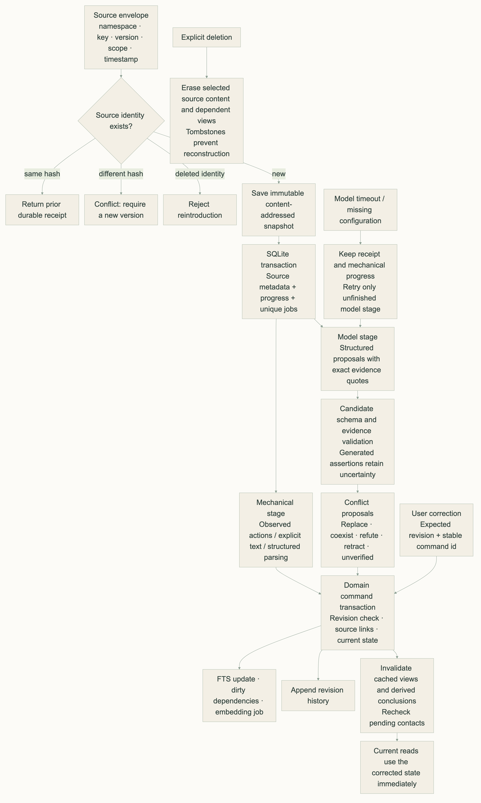
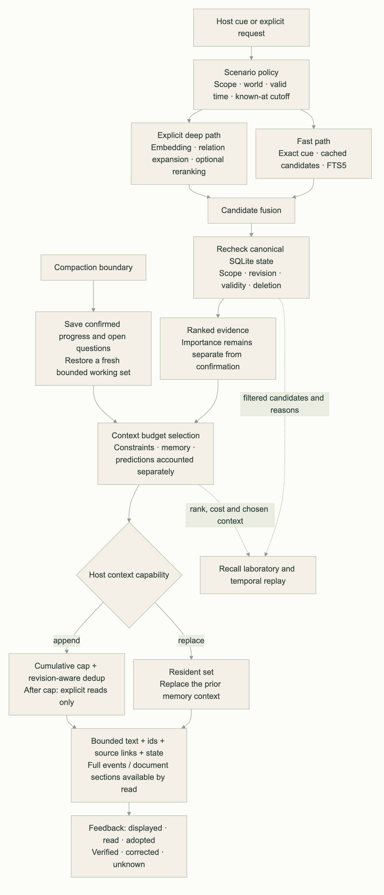
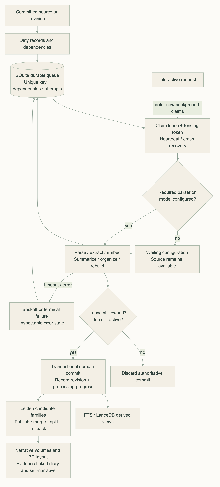
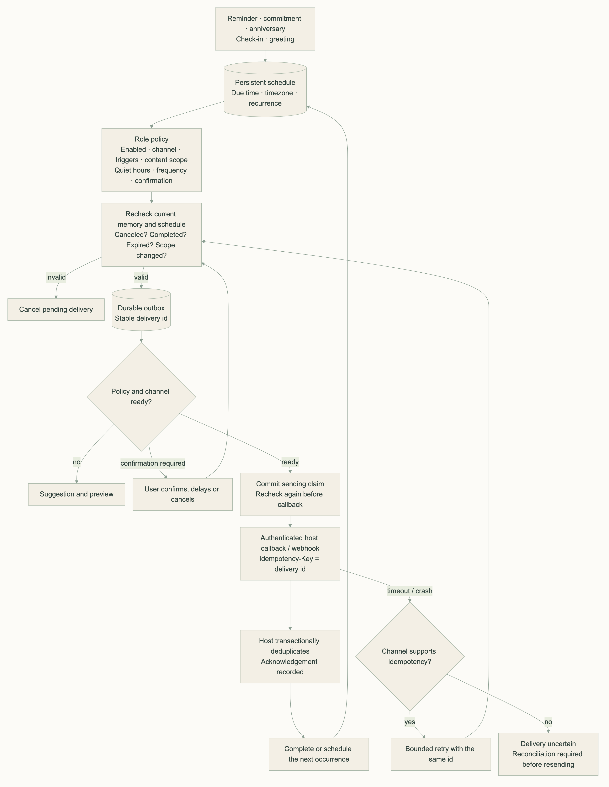

# MemoryPalace 1.0 · 记忆宫殿

**中文** · [English](README.en.md) · [日本語](README.ja.md)

MemoryPalace 是面向工具协作、陪伴与知识积累的单用户记忆系统。它保存来源、事实、经历、关系、承诺、知识片段和连续性状态，可通过插件、CLI、管理台、HTTP、MCP 与 SDK 使用。


## 功能

- **来源与写入**：保存原始来源，自动去重并记录处理进度。模型请求失败时，已保存的来源和进度会保留。
- **记忆类型**：记录情景、事实与状态、程序性经验、角色关系、共同经历、承诺与提醒，也保存日记、自述、知识和 checkpoint。项目、角色、知识库及现实／虚构领域可以分别设置范围。
- **召回**：支持按精确线索、全文、语义、图片和关系查找记忆，也可以读取历史时点的记录。返回内容会核对纠正后的有效状态，遵守上下文预算，并在不同宿主之间去重。
- **后台整理**：从来源中抽取记忆，提出冲突处理建议，并整理主题家族与叙事卷。摘要、日记和画像保留来源引用，整理结果支持修订与回滚。
- **文件与多模态**：接收 PDF、DOCX、PPTX、XLSX、Markdown、HTML、CSV、图片和音视频，保留页码、段落、表格位置、时间片段及附件位置。
- **主动联系**：按角色设置提醒、承诺跟进、纪念日、检查和问候，可配置时区、安静时段、频率与确认方式。待发内容可以延后或取消，重启后仍保留待发内容和投递记录。
- **管理台**：查看处理进度，浏览记忆、追溯来源并比较修订。管理台还提供时间线、日历、二维／三维关系图、知识与附件、日记、召回实验室，以及联系策略和数据维护设置。

模型生成的内容会明确标记。模型推断、用户明确表达的内容和客观操作分别记录；同一来源被重复引用时，仍只计为一份独立证据。

### 写入与纠正

记忆需要能追溯到来源，也需要允许后来的纠正。用户明确表达的内容与模型推断分开记录；不同项目、角色或时间下的差异可以并存，避免把各自成立的记录相互覆盖。纠正会更新当前读取的状态，并保留修订历史。模型处理失败时，来源与已完成的进度仍然保留，未完成的部分可以继续处理。



### 召回与上下文

召回优先考虑一条记忆是否适用于当前问题，以及当前对话能容纳多少内容。项目、角色和时间范围先限定候选，再核对有效状态，减少无关或失效内容进入上下文。日常交互采用快速查询，需要追查关系或历史时再按需深入。返回内容保留来源与读取入口，完整事件或文档章节可以继续查阅。



### 后台整理

长期整理在后台随记录变化逐步进行，以减少对当前交互的影响。主题、日记和摘要保留引用来源。分类归属和生成叙事不会提高一条记录的确认程度，也不会把模型推断转成用户事实。来源被纠正后，受影响的派生内容会标记为待核实，后续读取仍需检查其有效状态。



### 主动联系

主动联系的时机、频率和内容范围由用户按角色设置，安静时段与确认方式共同约束发送。发送前会重新核对事项是否已完成、取消或失效，避免继续依据旧状态联系。策略或渠道尚未配置时，只生成可预览的建议。渠道无法确认送达时，会保留不确定状态，供用户核对。



## 安装与启动

需要 Python 3.11–3.13、Node.js 22 和 [uv](https://docs.astral.sh/uv/)：

```sh
git clone https://github.com/mycyg/memory-palace.git
cd memory-palace
uv sync --frozen --extra all --extra dev
npm ci --prefix sdk/typescript
npm run build --prefix sdk/typescript
npm ci --prefix console
npm run build --prefix console
uv run eventmem console
```

管理台和服务的默认地址是 `http://127.0.0.1:8319`，私有数据默认保存在 `~/.memorypalace`。也可以用 `eventmem serve` 启动服务，用 `--root /private/path` 指定独立的数据目录。

在管理台为抽取、冲突判断、摘要、重排、embedding、视觉与 ASR 等角色配置模型。可以使用兼容 API 或本地端点，也可以让多个角色复用同一模型。密钥通过环境变量名称引用。某类模型尚未配置时，相关任务会显示待配置，原始来源仍会保存。

## 接入与示例

| 接入 | 能力 |
|---|---|
| Codex 原生 hooks + MCP | 自动采集提问、最终回复与工具结果；启动与提问时召回，压缩后恢复；支持 ACP／微信宿主 |
| Claude Code 插件 | 采集消息与工具记录，支持启动恢复、操作前查询、压缩恢复和退出处理 |
| `dsh-eventmem` | 将 DeepSeek Harness 事件接入统一服务；可显式启用旧版模式回退 |
| HTTP `/v1` | 来源、记忆、纠正、关系、连续性、任务、维护、调度与观测 |
| MCP | stdio 与 Streamable HTTP；工具式访问 |
| Python / TypeScript SDK | 调用记忆服务，并对回调去重 |
| `eventmem` CLI | 服务、管理台、MCP、写入／召回、迁移、备份、调度与评估 |

MCP 提供工具式访问。自动采集和被动注入需要接入宿主事件；使用插件时，本地服务需要保持运行。

Codex 可直接安装原生钩子：`uv run eventmem codex install --project /path/to/project`。重启后，在 `/hooks` 审阅并信任 MemoryPalace 的配置。[Codex 接入指南](docs/codex.md)包含 MCP、共享陪伴记忆与微信 ACP 的配置。

```sh
uv run python examples/v1/scenarios.py tool
uv run python examples/v1/scenarios.py companion
uv run python examples/v1/scenarios.py knowledge
node examples/v1/tool.mjs
```

[示例源代码](examples/v1/)包含工具协作、共同经历与承诺、文档导入，以及主动联系回调。发送策略和渠道尚未配置时，系统只生成待发建议。回调用稳定的 delivery id 去重；渠道不支持幂等时，会显示投递状态不确定。

## 实测

测试环境：**10 核 CPU、64 GiB 内存、SSD、macOS arm64、Python 3.13.14**。数据包括 10 万条记忆和 100 万个 1,024 维合成知识向量，查询使用独立样本。

| 指标 | 实测 |
|---|---:|
| 本地快速召回 p95 / p99 | 20.01 / 20.74 ms |
| 百万向量查询 p95 / p99 | 39.12 / 41.29 ms |
| ANN Recall@20 | 0.9985 |
| 上下文组装（含召回）p95 | 18.76 ms |
| 后台导入期间召回 p95 | 30.32 ms |
| 峰值 RSS（含构建） | 2.75 GiB |
| 并发去重 | 10 个会话，400 次请求，200 个唯一来源 |

表中时延不含外部模型请求，真实语料上的效果仍需单独验证。[测试详情](docs/performance.md)。

## 迁移与数据维护

```sh
uv run eventmem migrate /old/project/.memory --root /isolated/memorypalace
uv run eventmem backup /private/backup.tar.gz --root /isolated/memorypalace
uv run eventmem restore /private/backup.tar.gz --root /another/empty/root
```

迁移会保留原始 id、内容、归档包、修订关联和来源指针，并在独立的目标目录校验数据，旧库不会被覆盖。找不到的外部来源会明确标记。归档保留历史记录；永久删除会处理来源及其派生依赖。已导出的文件和备份需要单独管理。

## 文档与限制

[架构与数据语义](docs/architecture.md) · [配置、插件、迁移与运维](docs/operations.md)

快速全文检索先按范围筛选，再对最近匹配的最多 400 条记录排序。深度模式支持对完整匹配集排序，也支持模型检索。

PDF 默认解析原生文本，扫描页需要视觉端点。完整的本地布局模型可以选配。视觉检索需要兼容的多模态 embedding 端点。外部模型、重型解析和语料差异都会影响端到端时延与效果。

支持在 macOS／Linux 上进行单用户本地部署。

[MIT License](LICENSE)
