# MemoryPalace 1.0 architecture

MemoryPalace runs a single-user Python core behind a local service. Hosts, HTTP, MCP, the CLI and both SDKs use the same scope, revision, retrieval and context policy. SQLite is authoritative. Vector tables, FTS entries, topic layouts and caches can be rebuilt.

## Data and identity

Every source has a stable `(namespace, key, version, scope)` identity, a content hash, a durable snapshot, effective time, receipt time and independent mechanical/model progress. A scope contains `project`, `persona`, `collection` and `world`. Cross-project preferences are shared only when explicitly recorded in the shared preference scope; fictional and real-world claims stay separate.

Records cover episodes, facts, states, preferences, procedures, relationships, commitments, reminders, predictions, diaries, summaries, portraits, self narratives, knowledge, checkpoints and observations. Evidence links preserve the source and record dependencies. Distinct content hashes measure independent sources; repeated citations of one source add no independent evidence. Generated text retains its generated attribute. An inferred user fact cannot silently become an explicit assertion.

Revisions append history with compare-and-swap checks and stable command ids. Correction, confirmation, replacement, coexistence, refutation, retraction, archive, restore and rollback have distinct semantics. Document updates follow effective time. Checkpoints supersede earlier checkpoints for the same session. Historical reads distinguish effective time from the information available at the query cutoff.

## Durable processing

Receipt fsyncs an immutable content-addressed blob and commits source metadata before returning success. Jobs have stable keys, dependencies, leases, fencing, heartbeat renewal, retries, cancellation and configuration-wait states. An expired worker cannot commit after another worker owns its job. Duplicate callbacks and source retries resolve to the existing operation; changed payloads under the same id are rejected.

Large text extraction uses bounded batches and a dependent finalization job. All batches must complete before model progress becomes complete. Images, audio segments and video keyframes retain independent analysis tasks. Missing vision or ASR configuration does not discard the source or decoded pieces. Model outputs are proposals; validated program operations control canonical state.

Source deletion removes associated records, dependent generated accounts, revisions, attachment references, cached context and index entries. Tombstones prevent queued retries from re-creating erased sources. Vector purge removes obsolete index versions. Exported files and backups are independent copies and need their own retention management; this is logical deletion, not a claim of forensic disk erasure.

## Retrieval and context

The fast path uses exact ids, scope-filtered FTS candidates, precomputed cues, relation links and an in-memory cache without a generation request. Lexical candidate selection takes up to 400 recent scoped matches and ranks that bounded set with BM25. This gives predictable common-word latency but can miss an older globally stronger lexical match. Deep mode ranks the full FTS match set, adds optional query expansion, embedding, multimodal embedding and reranking. Every index result is checked against the current SQLite scope, status and revision before use.

LanceDB separates tables by model, dimension and preprocessing identity. IVF_HNSW_SQ is built for sufficiently large tables; small tables remain exact. Queries inspect newly added unindexed rows. Model changes create a new isolated table. Text and visual representations occupy different preprocessing namespaces. [LanceDB index capabilities](https://docs.lancedb.com/indexing/vector-index).

Context uses `cl100k_base` token accounting; hosts using other tokenizers should lower budgets if needed. Default startup budgets are 2,000 / 4,000 / 2,000 tokens for tool / companion / knowledge, and passive budgets are 256 / 512 / 256. Cumulative append-only budgets default to 12,000 / 16,000 / 12,000. Explicit reads share session accounting and return bounded segments. Constraints and predictions have separate accounts. Compact boundaries reset the context ledger. Event bodies are read whole when they fit; otherwise the host receives a labeled read hint. Display, reading, adoption, verified outcome, correction and same-file observation are separate feedback signals.

## Organization and continuity

Changed records and bounded neighbors feed igraph Leiden community discovery. Exact topic labels and stored relations create candidate connections; communities do not confirm facts. Families and volumes support candidate/publication state, explicit membership, merge, split, revisions and rollback. The console loads at most 300 graph nodes and uses stored layouts for generated communities.

Configured background jobs generate diaries, summaries, portraits, self narratives and tentative predictions with cited record ids. Corrections mark dependent generated accounts unverified transitively. Checkpoints retain goals, confirmed progress, unverified results, blockers, commitments and the next entry separately. Checkpoint cues can prefetch relevant records; final recall still checks validity.

## Multimodal sources

Markdown/plain text/CSV retain paragraph offsets or row locations. Docling handles office documents and HTML with native structure and provenance. PDF defaults to Docling's native text-cell backend; scanned pages use the configured vision service. Full local Docling layout parsing is an opt-in parser setting. Audio uses FFmpeg segments and configured ASR; video also keeps periodic keyframes. Text transcripts, page coordinates, original attachments and bounded clips remain linked. [Docling supported formats](https://docling-project.github.io/docling/usage/supported_formats/).

Visual embedding uses the Jina-compatible `/embeddings` image/text object schema. A compatible configured endpoint is required; it is separate from a text-only embedding service. [Multimodal embedding schema](https://jina.ai/en-US/embeddings/).

## Active contact

Per-role policies specify channel, triggers, allowed memory kinds, timezone, quiet hours, interval, daily limit and confirmation. Unconfigured installations produce suggestions. Sending rechecks the schedule and its referenced memory. Durable outbox claims precede the network call. A crashed or unacknowledged non-idempotent send becomes uncertain. Idempotent hosts can retry the stable delivery id and use the SDK's transactional inbox. Pause, resume, cancel and snooze use revision checks. A completed cancellation prevents later send initiation; an already accepted remote effect cannot be recalled.

## Interfaces and trust

FastAPI serves `/v1`, the bundled React console and authenticated MCP Streamable HTTP. MCP also supports stdio. [MCP transport specification](https://modelcontextprotocol.io/specification/2025-11-25/basic/transports). MCP provides tool access; automatic capture and passive injection require a host event adapter. Claude Code and DeepSeek Harness adapters spool receipt events when the service is unavailable. Their common service handles ranking and context policy.

The service listens on loopback and checks bearer credentials, Host and Origin. Model secrets are environment references. Source text, documents and returned memory are data and have no instruction authority. The private root defaults to `~/.memorypalace`; it is outside the repository. No accounts platform or platform-specific chat client is included.
